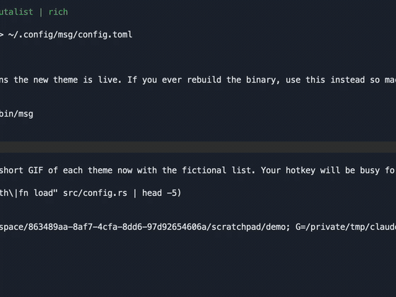
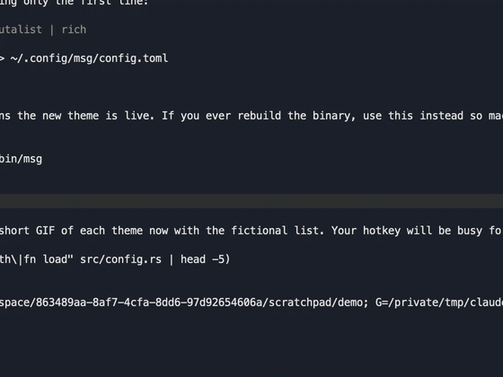
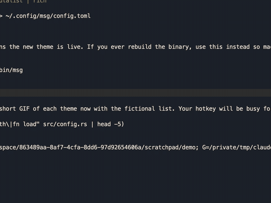
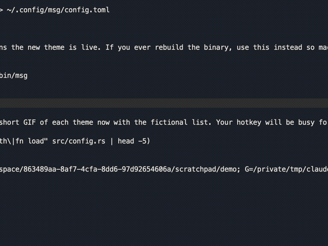
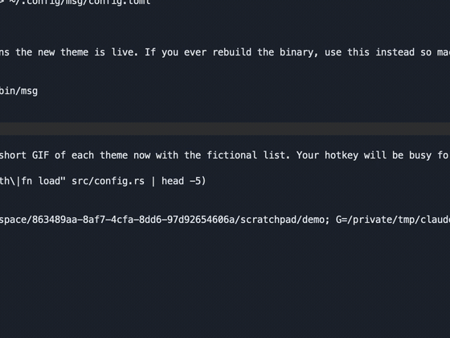

# msg

An fzf-style people picker for iMessage on macOS. Press a hotkey anywhere, type a
few letters, hit Enter, and you are in that conversation. One Rust binary, no
Electron, zero CPU while idle, popup in under 50 ms.

https://github.com/gshklovs/msg/releases/download/v0.1.0/msg-demo.mp4



Why: the Messages app's own "New Message" search is slow to populate and does not
select the top match on Enter. This does.

## Quickstart

There are two halves to setting this up. The build and install can be done by an
agent (Claude Code, Codex, whatever you use). The permission toggles can only be
done by a human clicking in System Settings. macOS enforces that split.

### What the agent does

Paste this section to your agent, or run it yourself.

```sh
# 1. Rust 1.88 or newer
rustup update stable

# 2. Build and install the binary
git clone https://github.com/gshklovs/msg
cd msg
cargo build --release
rm -f ~/.cargo/bin/msg          # remove first: copying over a running binary in place makes macOS kill it
cp target/release/msg ~/.cargo/bin/msg

# 3. Build the people list (reads chat.db and Contacts, takes about 50 ms)
msg index

# 4. Try it in the terminal
msg

# 5. Start the background daemon at login
msg install
```

Then tell the human to grant the two permissions below and to press the hotkey.
The agent cannot verify the hotkey; synthetic key events do not reach Carbon
hotkey registrations. After the human grants permissions, restart the daemon:

```sh
launchctl kickstart -k gui/$(id -u)/net.shklovski.msg
tail -3 ~/.cache/msg/daemon.log     # should no longer say "cannot read chat.db"
```

### What the human does

Both entries go in System Settings, Privacy & Security. In each pane click the
plus button, press Cmd+Shift+G in the file dialog, paste
`/Users/<you>/.cargo/bin/msg`, click Open, and make sure the toggle is on.

| Pane | Why |
|---|---|
| Full Disk Access | The daemon reads `~/Library/Messages/chat.db` and the Contacts database to refresh the list. Without it the daemon still runs on the last cached list; you just have to run `msg index` from a terminal to refresh. |
| Accessibility | Opening a *named* group chat drives the Messages search field through System Events. People and unnamed groups need nothing. |

Your terminal app needs the same two permissions for `msg` and `msg index` to
work from a shell. Most terminals already have them.

Then press **Cmd+Shift+M**. Type. Enter. Esc hides the popup.

### Configure

`~/.config/msg/config.toml`, two keys:

```toml
hotkey = "cmd+shift+m"
theme = "spotlight"
```

Modifiers are `cmd`, `ctrl`, `alt` (or `opt`), `shift`. Keys are letters, digits,
`space`, `enter`, `tab`, `escape`, and `f1` to `f12`. A missing file means the
defaults above. Restart the daemon after changing either key.

The theme picks how the popup looks. All five show the same list and answer the
same keys; an unknown name is an error that lists the valid ones.

| `theme` | |
|---|---|
| `spotlight` | Dark rounded panel, one line per row, matched letters in bold, key hints along the bottom. The default. |
| `terminal` | Monospace on `#0d1117`, square, prompt at the bottom with the list growing upward so the best match sits next to your cursor. |
| `editorial` | Warm paper-dark serif, initials in tinted discs, and a line of prose per row: "Texted an hour ago". |
| `brutalist` | Black and acid yellow, hard rules, a fat block cursor, and the selected row as a full yellow bar. |
| `rich` | Dense product rows: rounded avatar, name, group chips, subtitle, timestamp. Tab cycles the All / People / Groups filter. |

Switch with one block, changing only the first line, then press the hotkey:

```sh
THEME=brutalist   # spotlight | terminal | editorial | brutalist | rich
mkdir -p ~/.config/msg
printf 'hotkey = "cmd+shift+m"\ntheme = "%s"\n' "$THEME" > ~/.config/msg/config.toml
launchctl kickstart -k gui/$(id -u)/net.shklovski.msg
```

| spotlight | terminal |
|---|---|
|  |  |

| editorial | brutalist |
|---|---|
|  |  |

| rich | |
|---|---|
|  | |

Fonts are bundled with the binary under `assets/fonts`, each with its SIL Open
Font License: JetBrains Mono, Instrument Serif, Instrument Sans, Space Grotesk
and IBM Plex Sans, all instanced from the variable originals in `google/fonts`.

Environment variables:

| Variable | Effect |
|---|---|
| `MSG_CACHE` | Path to a people list to use instead of the real one. Also pins it, so the daemon will not rebuild from your databases. Used for demos and tests. |
| `MSG_PERF` | Log how long a popup and a keystroke took, to `~/.cache/msg/daemon.log`. |

## Commands

```
msg              fuzzy picker in the terminal
msg open QUERY   open the best match for QUERY without a picker (for scripts and launchers)
msg index        rebuild the people cache
msg daemon       stay resident, popup on the global hotkey
msg install      start the daemon at login (launchd)
msg uninstall    stop starting the daemon at login
```

## How it works

- **Index.** Contacts come from the AddressBook SQLite files, chats from chat.db.
  Phone numbers are normalized to E.164 so handles join to contacts. Each person
  gets their name, handles, and the timestamp of their last message. Group chats
  are named by their display name or their members. Sorted by recency and cached
  to `~/.cache/msg/people.json`. The cache is rebuilt automatically whenever
  either database's mtime changes.
- **Matching.** The `nucleo-matcher` crate, the same fzf-style scorer Helix uses.
  Ties go to the shorter name, then recency. Empty query shows recency order.
- **Opening.** People open through the `imessage://` URL scheme. Unnamed groups
  open by addressing a new message to their exact participants, which Messages
  resolves to the existing thread. Named groups cannot be reached that way and
  Messages has no scripting command to show a chat, so they are opened by
  focusing the Messages search field, typing the name, Down, Enter.
- **Daemon.** eframe/egui window, hidden until a Carbon global hotkey fires.
  Idle CPU is zero because nothing repaints while hidden.

The daemon logs to `~/.cache/msg/daemon.log`.

## Not doing

Reading messages, composing, sending, or anything touching Messages beyond
opening a conversation.

## Development

```sh
cargo test
cargo clippy --all-targets
MSG_CACHE=path/to/fake-people.json cargo run -- daemon   # demo with fictional data
```

Design spec: `docs/superpowers/specs/2026-09-06-msg-picker-design.md`.
